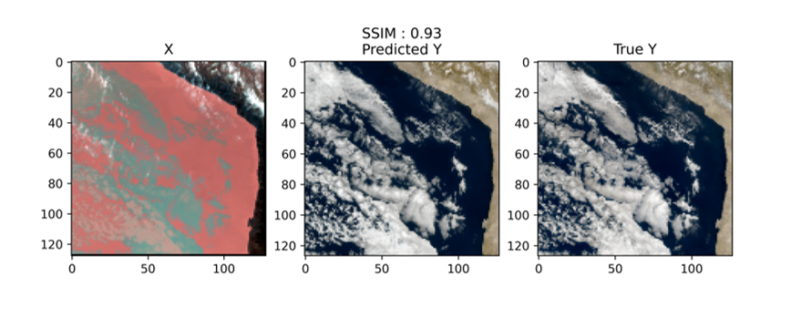
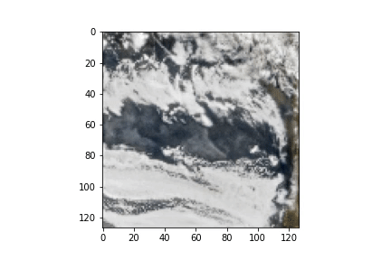

This is our entry to the [Climate Informatics hackathon 2020](https://ci2020.web.ox.ac.uk/) in which we came 1st. Our solution is based on U-Net++ [1].

The public version of the hackathon can be found here:
[https://competitions.codalab.org/competitions/26644](https://competitions.codalab.org/competitions/26644)

The dataset for the hackathon is hosted here:
[https://zenodo.org/record/4061336#.X3mvkGhKhPY](https://zenodo.org/record/4061336#.X3mvkGhKhPY)

#### The challenge
The challenge was an image-to-image regression problem, to predict RGB satellite images from their infrared counterparts, with data coming from GEOS-16.

  

Ultimately we would like to be able to estimated night RGB images. What would the clouds look like in the visible channels if we could see them? Obviously the visual channels are not available at night whilst the infrared channels are.

Here is an example of our predictions on a 3 day sequence including both day and night.

  

#### Data sources
GOES-16 ABI cloud & moisture imagery product data is provided courtesy of the National Oceanic and Atmospheric Administration (NOAA) Big Data Program. GOES-16 data can be acquired through [google cloud storage](https://console.cloud.google.com/marketplace/product/noaa-public/goes-16?filter=solution-type:dataset&q=NOAA&id=5babd633-afa0-4e40-9dba-0587f4aabc47&project=dcc-detect&folder=&organizationId=)

#### The metrics
The optimisation metrics use was [Structural similarity index (SSIM)]((https://en.wikipedia.org/wiki/Structural_similarity)).

#### Notebooks
We tried a number of variations of U-Net++ (which scored better than a standard U-Net) including differences in preprocessing, deep supervision and injecting time information in the first level of the network.

Our best solution (measured by SSIM) in the challenge was based on notebook `02`. But evaluating by our own perception of the output images `03` was better as it removed the dark patches in images. `05` was better still as it had sharper, more believable shadows.

References

[1] Zhou, Zongwei et al. _“UNet++: Redesigning Skip Connections to Exploit Multiscale Features in Image Segmentation.”_ IEEE transactions on medical imaging vol. 39,6 (2020): 1856-1867. doi:10.1109/TMI.2019.2959609
